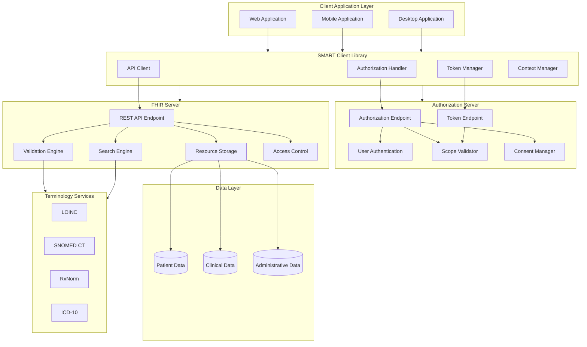

# Summary

This deep dive covered SMART-on-FHIR from “what is it?” to “how do I actually build and debug a working client?”.

If you only remember one thing: **SMART is the authorization + launch context; FHIR is the data model + API surface.** Real-world apps succeed when they treat these as *one integrated contract* (not two separate topics).

---

## The end-to-end story (in one page)

- **You start with a FHIR base URL** (an EHR’s FHIR endpoint, or a sandbox).
- **You discover SMART capabilities dynamically** via `/.well-known/smart-configuration` (auth endpoints, supported scopes, PKCE methods, etc.).
- **You launch + authorize** (EHR launch or standalone) using OAuth 2.0 Authorization Code (and **PKCE** for public clients).
- **You get tokens** and (optionally) OpenID Connect identity claims (`openid`, `fhirUser`, etc.).
- **You call FHIR REST APIs** to read/search resources (and sometimes write), handling:
  - Search/pagination/bundles
  - Resource relationships (`reference`, `_include`, `_revinclude`)
  - Terminology (codes, `CodeableConcept`, value sets)
  - Validation + error handling (`OperationOutcome`)
- **You secure + operationalize**: token storage, refresh, logout/revocation, logging, least-privilege scopes, and safe UI defaults.

---

## SMART-on-FHIR Complete Architecture (diagram)

---

## How to “read” the architecture diagram

- **Client apps** (web/mobile/desktop) shouldn’t hardcode vendor endpoints or assumptions; they rely on a SMART client component to unify:
  - Discovery
  - OAuth redirect handling
  - Token lifecycle
  - “FHIR base URL + patient context” wiring
- **Authorization server** decisions are about *identity, consent, and policy*:
  - Who is the user?
  - What scopes are requested and allowed?
  - Is the app public vs confidential (and is PKCE required)?
- **FHIR server** decisions are about *data access and correctness*:
  - Are you authorized for this resource type + instance?
  - Can the server satisfy your search query efficiently?
  - If you are writing, does the resource validate against base spec and profiles?
- **Terminology services** are the “hidden dependency” for correctness:
  - Meaningful clinical queries often depend on codes (LOINC/SNOMED/RxNorm) and value sets, not strings.

---

## Common implementation pitfalls (and how to avoid them)

- **Treating discovery as optional**: always retrieve and cache `/.well-known/smart-configuration`; don’t assume endpoints/scopes.
- **Requesting overly broad scopes**: start minimal (e.g., `patient/Patient.read patient/Observation.read`) and expand intentionally.
- **Skipping PKCE** (public clients): for SPAs/mobile, PKCE is non-negotiable in practice.
- **Assuming references always resolve**: in the wild, you will see missing/broken references; code defensively and degrade gracefully.
- **Ignoring pagination**: many “it works in the sandbox” apps fail against real EHRs because they don’t follow `Bundle.link[relation="next"]`.
- **Not surfacing `OperationOutcome`**: it’s the closest thing FHIR has to a structured error report; parse and display it.

---

## Suggested next steps (practical projects)

- **Add a second server target**: run your client against two different endpoints and make discovery drive everything (no per-vendor config).
- **Add a “resource graph fetcher”**: given a `Patient/{id}`, fetch a coherent clinical slice using:
  - `Observation?patient=...&category=...`
  - `_include` / `_revinclude` where useful
  - Bundle pagination handling
- **Add profile-aware validation**: detect and explain “base FHIR valid, profile invalid” cases (e.g., US Core).
- **Threat model your app**: map token storage, redirect handling, and error surfaces; implement mitigations from your own checklist.

---

## Where to go back and review

- **If OAuth felt fuzzy**: revisit SMART authorization + configuration discovery.
- **If searches felt fuzzy**: revisit search parameters, bundles, and pagination patterns.
- **If the data model felt fuzzy**: revisit data types, terminology, and relationships.